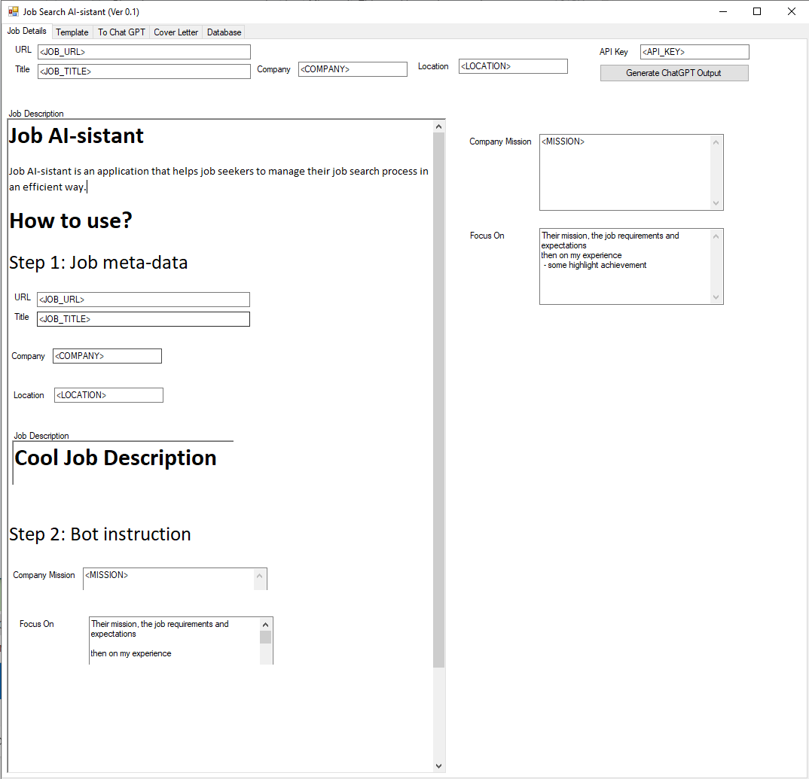
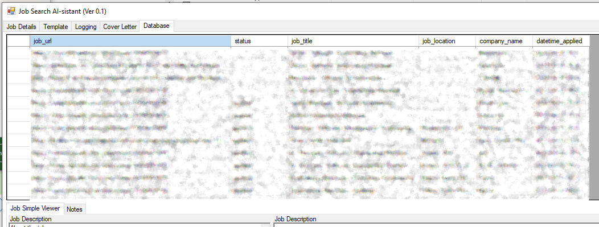

# Job AI-sistant
Job AI-sistant is an application that helps job seekers to manage their job search process in an efficient way. This tool is useful for generating a fluent cover letter based on a template, and a job description. It is essentially form to generate an affective prompt for ChatGPT.


**Please use it responsibly.** Review [RESPONSIBLE_AI_CODE_OF_CONDUCT](./RESPONSIBLE_AI_CODE_OF_CONDUCT.md)  and [CONTRIBUTOR_COVENANT_CODE_OF_CONDUCT](./CONTRIBUTOR_COVENANT_CODE_OF_CONDUCT.md) first.

This tool is developed during the great lay-off in 2022/2023, and at that time recruiters are overwhelmed with irrelevant application. **Do your part** and review the job description at least twice, take notes, and decide if the job is a good match before applying.

The big picture can be from [here](./docs/PR.md). This is still work in progress, it has a lot of bugs see [known issues](#Known-Issues) . I stopped at the point where it was useful to me, and will continue to add features when I have time.

# Setting up development environment

## Understanding the UI

The tool is not full automated yet, there are some manual steps that the use has to do to tell the AI what they care about the most, and 
if there a cover letter template they want the AI to use for reference. this is the main screen, with the main 5 tabs: [`Job Details`, `Template`, `Logging` `Cover Letter`, `Database`]

### Step 1: Fill in the Job Details fields

| Field name | Usage |
| ---|--- |
| URL | The Url the job was found on, this is the primary key in the DB |
| Title | The job title, will use the keyword replacement `<JOB_TITLE>` in template |
| Company | Company name, `<COMPANY>` in template |
| Location | Company name, `<LOCATION>` in template |
| Company Mission | Company mission, `<MISSION>` you can instruct in the prompt to search for it |
| Focus On | things to direct the bot to focus on, Keyword in template is `<FOCUS_ON>` |



Once you click `Generate ChatGPT Outlput` it will generate the following prompt:

```
Customize this following cover letter template delimited by triple backticks.
in one page, in Rich Text Format : 
```<COVER_LETTER_TEMPLATE>```
with the the following job description delimited by triple backticks ```<JOB_TITLE>```
 at ```<COMPANY>```
Focusing on:
<FOCUS_ON>

Their Mission is:
```<MISSION>```
The Job Description - delimited by triple backticks -  is:
```<JOB_DESCRIPTION>```
```
## Step 2

if the API succeeds, it will append the results to the `Cover Letter` and switch to it. 
if not, it will dump the prompt and result in the `Loggin` tab.

## Step 3

If you are happy with the result, you can update the data base, or just save the cover letter locally

after updating the database you will have a record of the jobs you applied to:



## User provided files
You have to provide these files in the [./resources](./resources) folder
|Files name | Usage|
|---|---|
|.API_KEY | OpenAI Key; get from [here](https://platform.openai.com/account/api-keys) |
|cl-header.rtf | The header for the cover letter, see [sample-cl-header.rtf](./resources/sample-cl-header.rtf) |
|cl-template.rtf | The template to use for field replacement like `<JOB_TITLE>`, `<COMPANY>`. see [sample-cl-template.rtf](./resources/sample-cl-template.rtf)|
|FocusOn.txt | Your top things you want the bot to focus on. see [sample-FocusOn.txt](./resources/sample-FocusOn.txt)|

## Known Issues

## What's next?
These is a large set of features I like to implement see the big picture can be from [here](./docs/PR.md)

[ ] I like to have a different prompt. Here is how I like to do it.. use the Cover letter Template to include the prompt template
[ ] Full automation. Just start from the job URL, and let the app do the rest
[ ] React.JS / React native. It would be nice to rnn this from my mobile
